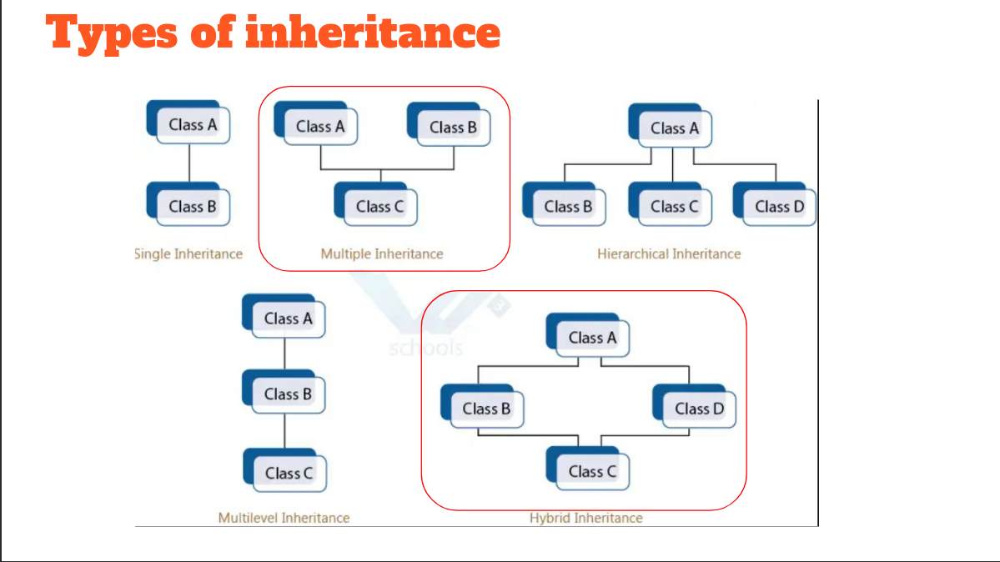

# inheritence

- Inheritence is a mechanism in which one class acquires the properties and behavior of another class.
- The class that inherits the properties of another class is called the derived class or child class.
- The class whose properties are inherited is called the base class or parent class.

## In inheritance we should follow the rule of "is a" relationship

### `if we have a class vehicle.`

- we cas say that a car is a vehicle.
- we can say that a truck is a vehicle.
- we can say that a BMW is a car which is a vehicle.

```cpp

#include <iostream>


class Base
{
public:
    Base()
    {
        std::cout << "Base Constructor" << std::endl;
    }
    void display()
    {
        std::cout << "Display of Base" << std::endl;
    }
    ~Base()
    {
        std::cout << "Base Destructor" << std::endl;
    }
};

class Derived : public Base
{
public:
    Derived()
    {
        std::cout << "Derived Constructor" << std::endl;
    }
    ~Derived()
    {
        std::cout << "Derived Destructor" << std::endl;
    }
};

int main (){
    Derived d;
    d.display();
    return 0;

    /****
    Output:
    1-Base Constructor
    2-Derived Constructor
    3-Display of Base
    4-Derived Destructor
    5-Base Destructor
    *****/
}

```

- In the above example, we have a base class `Base` and a derived class `Derived`.

- The derived class `Derived` is inheriting the properties of the base class `Base` using the `public` keyword, so the public members of the base class `Base` will become the public members of the derived class `Derived`.

- The constructor of the base class `Base` is called first, then the constructor of the derived class `Derived` is called.

- The destructor of the derived class `Derived` is called first, then the destructor of the base class `Base` is called.

## Types of Inheritance



- Single Inheritance
- Multiple Inheritance
- Multilevel Inheritance
- Hierarchical Inheritance
- Hybrid Inheritance

### `Single Inheritance`

- In single inheritance, a class is allowed to inherit from only one class. `JUST LIKE THE EXAMPLE ABOVE.`

### `Multilevel Inheritance`

- In multilevel inheritance, a class is derived from another derived class.
    
    ```cpp
    class A
    {
    public:
        A()
        {
            std::cout << "A Constructor" << std::endl;
        }
        void display()
        {
            std::cout << "Display of A" << std::endl;
        }
        ~A()
        {
            std::cout << "A Destructor" << std::endl;
        }
    };

    class B : public A
    {
    public:
        B()
        {
            std::cout << "B Constructor" << std::endl;
        }
        void show()
        {
            std::cout << "Show of B" << std::endl;
        }
        ~B()
        {
            std::cout << "B Destructor" << std::endl;
        }
    };

    class C : public B
    {
    public:
        C()
        {
            std::cout << "C Constructor" << std::endl;
        }
        void view()
        {
            std::cout << "View of C" << std::endl;
        }
        ~C()
        {
            std::cout << "C Destructor" << std::endl;
        }
    };

    int main()
    {
        C c;
        c.display();
        c.show();
        c.view();
        return 0;
    }
    /***
    Output:
    1-A Constructor
    2-B Constructor
    3-C Constructor
    4-Display of A
    5-Show of B
    6-View of C
    7-C Destructor
    8-B Destructor
    9-A Destructor
    ```

### `Hierarchical Inheritance`

- In hierarchical inheritance, more than one class is derived from a single base class.

    ```cpp
    class employee
    {
    public:
        employee()
        {
            std::cout << "Employee Constructor" << std::endl;
        }
        void display()
        {
            std::cout << "Display of Employee" << std::endl;
        }
        ~employee()
        {
            std::cout << "Employee Destructor" << std::endl;
        }
    };

    class manager : public employee
    {
    public:
        manager()
        {
            std::cout << "Manager Constructor" << std::endl;
        }
        void show()
        {
            std::cout << "Show of Manager" << std::endl;
        }
        ~manager()
        {
            std::cout << "Manager Destructor" << std::endl;
        }
    };

    class HR : public employee
    {
    public:
        HR()
        {
            std::cout << "HR Constructor" << std::endl;
        }
        void view()
        {
            std::cout << "View of HR" << std::endl;
        }
        ~HR()
        {
            std::cout << "HR Destructor" << std::endl;
        }
    };

    int main()
    {
        manager m;
       
        HR h;
       
        return 0;
    }
    /***
    Output:
    1-Employee Constructor
    2-Manager Constructor
    3-Employee Constructor
    4-HR Constructor
    5-HR Destructor
    6-Employee Destructor
    7-Manager Destructor
    8-Employee Destructor
 
    ```

### `Multiple Inheritance`

`Prohibited by Misra`

- In multiple inheritance, a class is derived from more than one class.

```cpp
class A
    {
        public:
        void fun(){
            std::cout<<"Fun A"<<std::endl;
        }
    };
    class B
    {
        public:
        void fun(){
            std::cout<<"Fun B"<<std::endl;
        }
    };
    class AB :public A, public B{

    };

    int main (){
        AB obj;
        
        obj.fun(); //ambigous call
        /* Can be Fixed Like This*/
        obj.A::fun();
        obj.B::fun();


    }

```

### `Hybrid Inheritance`

- Hybrid inheritance is a combination of multiple inheritance and multilevel inheritance.

```cpp
#include <iostream>
class A
{
    public: 
    int a;
public:
    void display()
    {
        std::cout << "Display of A" << std::endl;
    }
};

class B : virtual public A
{
public:
    
};

class C : virtual public A
{
public:
    
};

class D :  public B,  public C
{
public:
    
};

int main()
{
    D d;
    d.display();
    
    return 0;
}

```

- `Using the Virtual Keyword Resolved The Problem of Ambigous Call`

### abstract class and interface class 
- you cannot creat instanse from the abtract or interface classes 
- abstract class example
```cpp
#include <iostream>
#include <fstream>
#include <stdexcept>
#include <string>

class Logger {
public:
    enum Level { Info, Warning, Error };
    static constexpr const char *PASSWORD = "Moatasem";

    virtual void log(Level level, const std::string &message) = 0;
    void help() { std::cout << "help" << std::endl; }
};

class FileSystem : public Logger {
public:
    FileSystem(std::string password) {
        if (password != Logger::PASSWORD) {
            throw std::runtime_error("Invalid password");
        }
    }

    void log(Level level, const std::string &message) override {
        std::fstream fs("log.txt", std::ios::app);
        fs << message << std::endl;
        fs.close();
    }
};

int main() {
    // Calling the base class constructor explicitly using 'using'
    FileSystem log_handler(Logger::PASSWORD);

    log_handler.log(Logger::Level::Info, "This is an info message");
    return 0;
}
```
- interface class example
```cpp
#include <iostream>

class Shape {
public:
    virtual void draw() = 0; // Pure virtual function, making Shape an abstract class
};

class Circle : public Shape {
public:
    void draw() override {
        std::cout << "Drawing a circle." << std::endl;
    }
};

class Square : public Shape {
public:
    void draw() override {
        std::cout << "Drawing a square." << std::endl;
    }
};

int main() {
    Circle circle;
    Square square;

    Shape* shapes[] = { &circle, &square };

    for (Shape* shape : shapes) {
        shape->draw(); // Using abstraction to draw different shapes
    }

    return 0;
}
```
- `Note:`
    - `abstract class` is a class that has at
        least one pure virtual function.
    - `interface class` is a class that has all
        pure virtual functions.
    - `abstract class` can have data members
        and concrete functions.
    - `interface class` can only have pure
        virtual functions.
    - `abstract class` can have constructors
        and destructors.
    - `interface class` cannot have constructors
        and destructors.
    - `abstract class` can have access
        specifiers.
    - `interface class` cannot have access
        specifiers.


# Polymorphism

- Polymorphism is a Greek word that means "many-shaped" and it has two types:
    - Compile-time polymorphism
    - Run-time polymorphism

## Compile-time polymorphism

- Compile-time polymorphism is also known as static polymorphism.

- Compile-time polymorphism is achieved by function overloading and operator overloading.

### Function Overloading

- Function overloading is a feature that allows us to have more than one function with the same name but with different parameters.

```cpp
#include <iostream>


class Add
{
public:
    void sum(int a, int b)
    {
        std::cout << "Sum of two integers: " << a + b << std::endl;
    }
    void sum(double a, double b)
    {
        std::cout << "Sum of two doubles: " << a + b << std::endl;
    }
};

int main()
{
    Add a;
    a.sum(10, 20);
    a.sum(10.5, 20.5);
    return 0;
}
```
**Explanation:**

- In the above example, we have a class `Add` with two functions `sum`.

- The first function `sum` takes two integers as parameters and the second function `sum` takes two doubles as parameters.

- When we call the `sum` function with two integers, the first function will be called and when we call the `sum` function with two doubles, the second function will be called.

`This is Called Function Overloading`

### Operator Overloading

- Operator overloading is a feature that allows us to redefine the operator's functionality.

```cpp

#include <iostream>

class Complex
{
    
public:
    int real, imag;
    Complex(int r = 0, int i = 0)
    {
        real = r;
        imag = i;
    }
    Complex operator+(Complex const &obj)
    {
        Complex res;
        res.real = real + obj.real;
        res.imag = imag + obj.imag;
        return res;
    }
};

int main()
{
    Complex c1(10, 5), c2(2, 4);
    Complex c3 = c1 + c2;
    std::cout << c3.real << " + i" << c3.imag << std::endl;
    return 0;
}
```

**Explanation:**


- In the above example, we have a class `Complex` with two data members `real` and `imag`.

- We have overloaded the `+` operator using the `operator+` function.

- When we add two objects of the `Complex` class using the `+` operator, the `operator+` function will be called.

- The `operator+` function will return a new object of the `Complex` class with the sum of the real and imaginary parts of the two objects.

`This is Called Operator Overloading`

## Run-time polymorphism

- Run-time polymorphism is also known as dynamic polymorphism.

- Run-time polymorphism is achieved by function overriding.

### Function Overriding

- Function overriding is a feature that allows us to have a function in the derived class with the same name as a function in the base class.

```cpp
#include <iostream>

class Base
{
public:
    virtual void display()
    {
        std::cout << "Display of Base" << std::endl;
    }
};

class Derived : public Base
{
public:
    void display()
    {
        std::cout << "Display of Derived" << std::endl;
    }
};

int main()
{
    Base *b;
    Derived d;
    b = &d;
    b->display();
    return 0;
}
```

**Explanation:**

- In the above example, we have a base class `Base` with a virtual function `display`.

- We have a derived class `Derived` that is inheriting the base class `Base`.

- We have overridden the `display` function in the derived class `Derived`.

- We have created a pointer of the base class `Base` and assigned the address of the derived class `Derived` to it.

- When we call the `display` function using the base class pointer, the `display` function of the derived class `Derived` will be called.

`This is Called Function Overriding`

